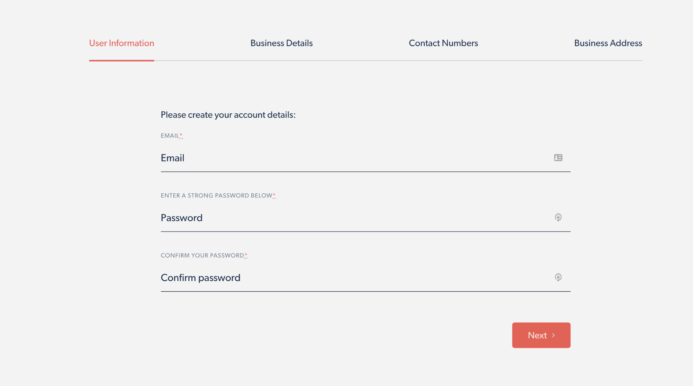
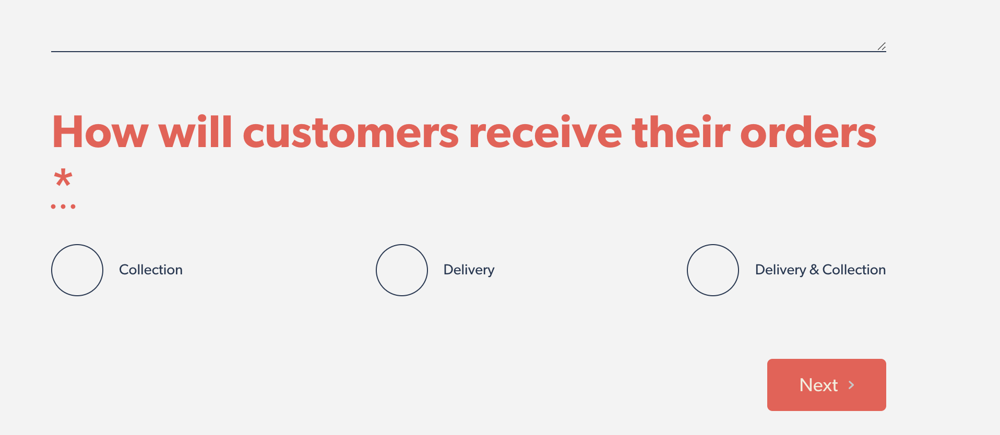
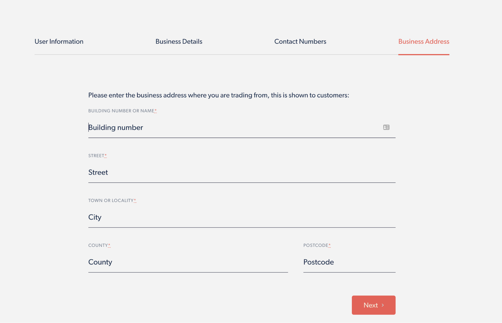

# User Information
User Information is the first section you will find upon your Merchant Signup
Journey, this section will ask you to enter a valid email address and a
strong password. This information will then be what you will need
to provide to log into your Merchant Dashboard to manage your orders.

# Business Details

Business Details is the second section you will need to complete during
your Merchant Signup, this section is where you will enter all the
information to do with your business. On the left hand side of the
page it allows you to upload your company logo (if you have one),
your business name and your business URL slug. This URL slug will
be what you provide to your customers to view your menu and place
an order, for example, if your business is called ‘Red Lion’ this
would make your URL slug 'https://aweder.net/red-lion' to help
distinguish your business. Below this gives you the opportunity
to enter a description about your business, this can be in as
much detail as you chose or you can use this description to state
any notes for your order form e.g ‘this is thursdays menu’.

If you scroll a little further down this page it will ask you
how you want to receive your customer orders, this gives you
three options; Delivery, collection or both.

If you select delivery or both, it will ask you some further
questions such as your delivery charge and the radius in
which you will deliver. However if you select the collection
option, then these are not required. Once completed you are
halfway through the signup process.

# Contact Numbers

Contact numbers is the third section required during the Merchant
Signup Process. Here it will ask you to provide a public and a private
telephone number. The public telephone number is for customers to
use (this is shown to customers) if they need to contact a merchant
with an issue or a question. In addition to the public telephone number
we ask that a private telephone number is also provided that allows
this to potentially be used in the future for notifications
(this will not be visible to customers)

# Business Address

Entering your Business address is the final stage of your Merchant
signup process. Here you will be required to enter a valid business
address from where you are trading. This is something that will
be shown to customers. This address needs to be the one in which
customers (if collecting an order) can go to This can be changed
after signup has been complete from within the Merchant Dashboard

